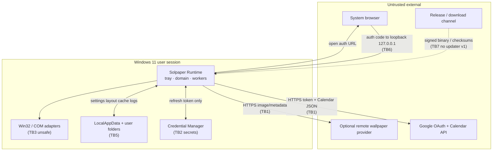
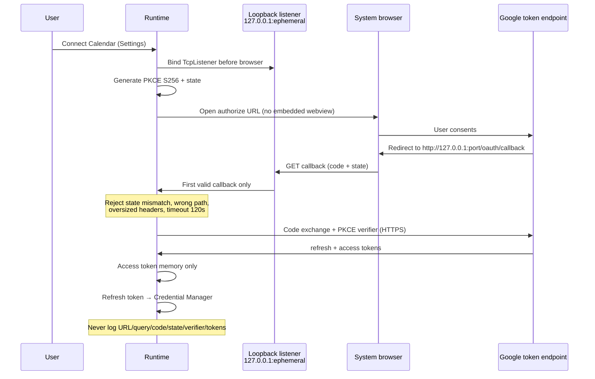
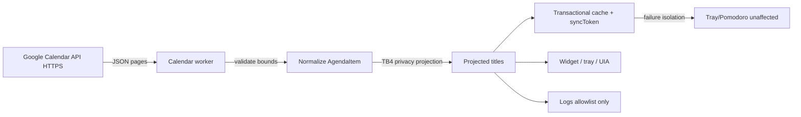
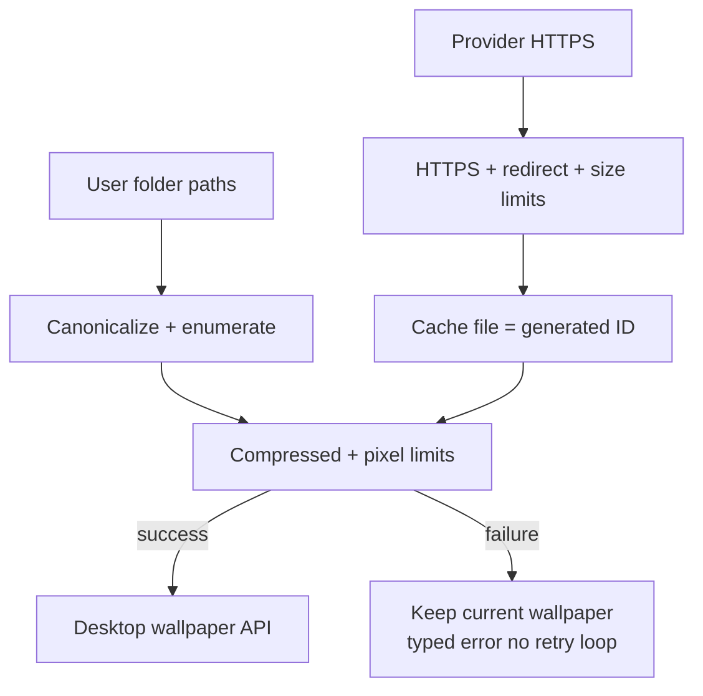

# Data-flow and trust-boundary diagrams

**Issue:** [#36](https://github.com/rps321321/solpaper/issues/36)  
**Companion:** [`threat-model.md`](./threat-model.md)

## System context

## OAuth connect (F1)

## Calendar sync (F2)

## Wallpaper apply (F3 / F4)

## Secrets and non-secrets placement

| Data | Credential Manager | Settings file | SQLite/runtime | Memory | Logs (default) |
|------|:-----------------:|:-------------:|:--------------:|:------:|:--------------:|
| Refresh token | Yes | No | No | Load only | No |
| Access token | No | No | No | Yes | No |
| PKCE/state/code | No | No | No | Connect only | No |
| Event titles | No | No | Yes (cache) | Yes | No (raw) |
| Projected title | No | No | Optional | Yes | Prefer codes only |
| Layout / settings | No | Yes | Optional | Yes | Redacted |
| Wallpaper cache path IDs | No | No | Optional | Yes | IDs only |

## Boundary checklist for implementers

1. Crossing **TB1**: use the single shared HTTPS client config; no second HTTP stack in Alpha 2.
2. Crossing **TB2**: only through `CredentialStore` trait; test fakes in-memory.
3. Crossing **TB3**: no `unsafe` outside `solpaper-windows` (or documented adapter module).
4. Crossing **TB4**: projection function is the only path to UI/UIA/notifications/export.
5. Crossing **TB5**: path helpers canonicalize; atomic write pattern for settings.
6. Opening **TB8 IPC**: blocked until ADR + threat-model update.
